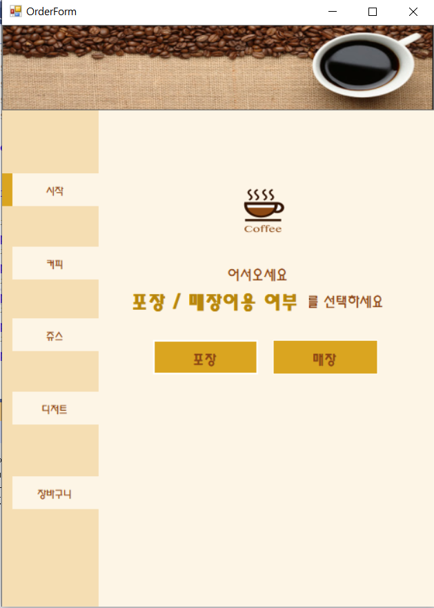
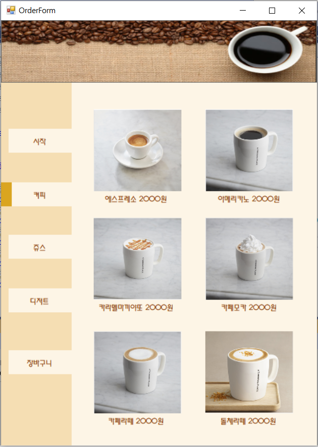
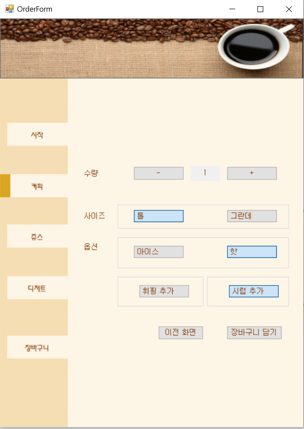
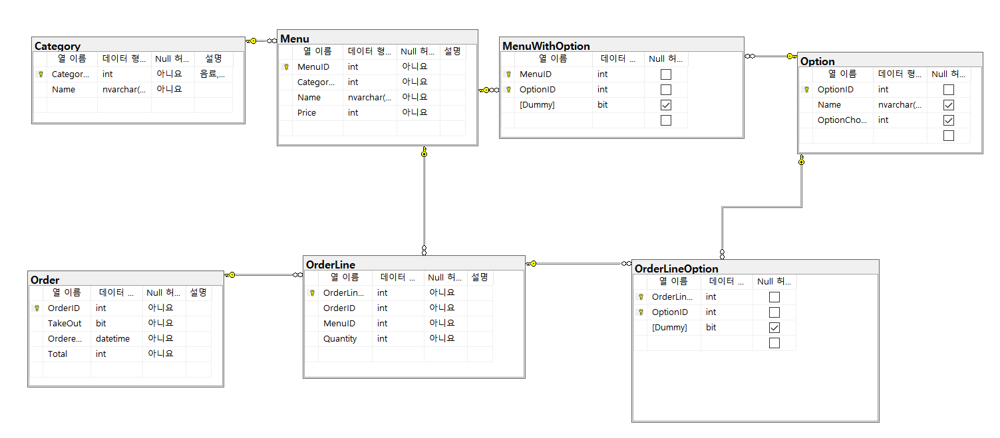
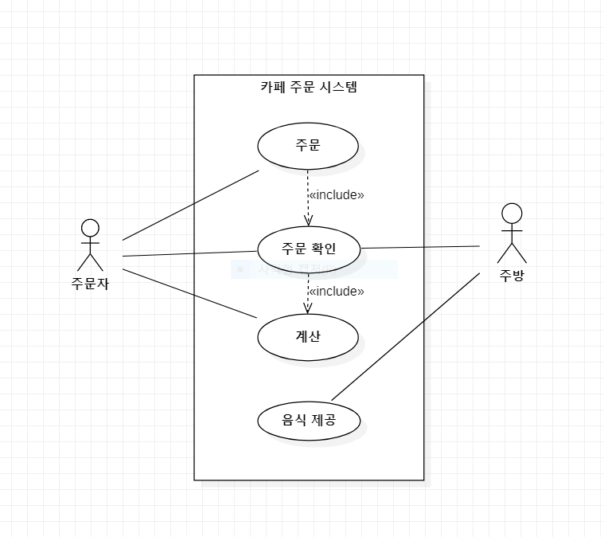
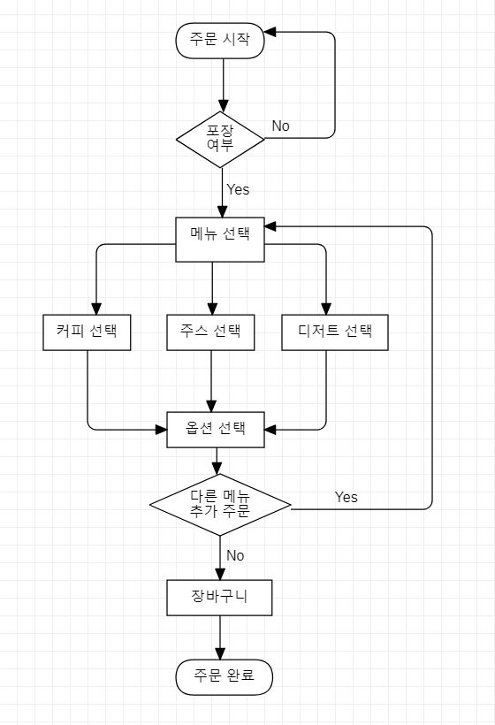
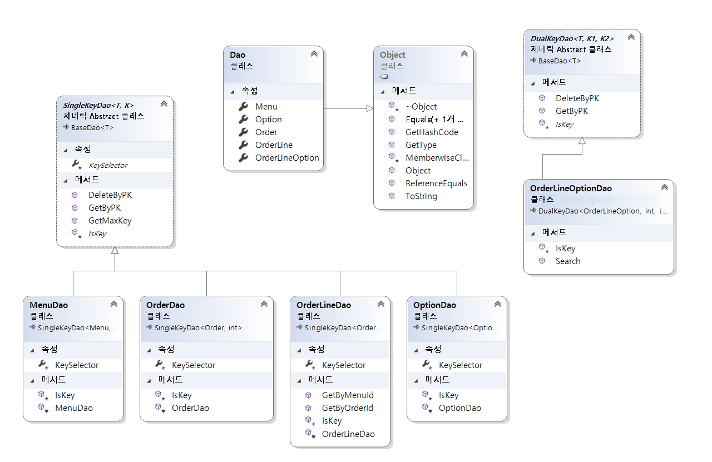
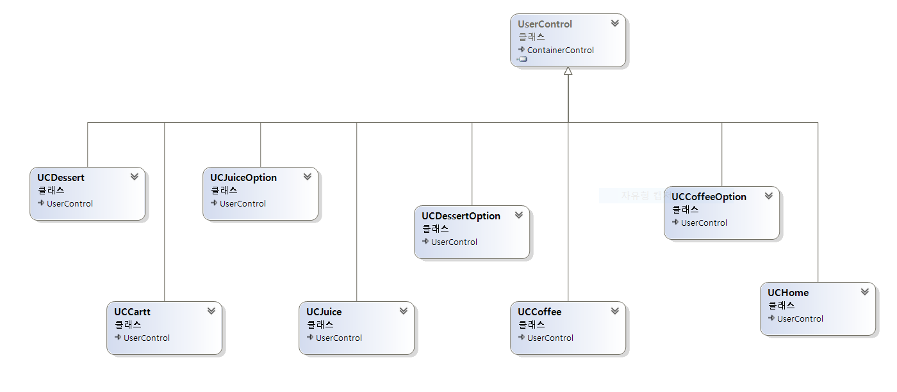
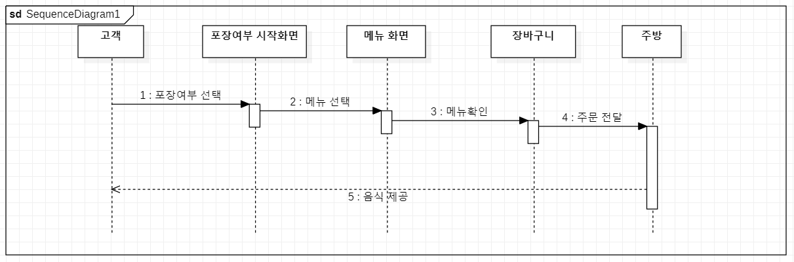

# 카페 키오스크 시스템

## 개요

- 카페에서 사용하는 키오스크(무인 단말기) 시스템을 C# .NET Framework 및 EntityFramework를 이용해 구현하였다.

## 개발 기간

- 2020년 11월 23일 ~ 2020년 11월 29일

## 기능 목록

### 1. 메인화면 포장/매장이용 선택

- 메인화면에 포장과 매장이용 선택을 하면 다음 창으로 넘어간다.

### 2. 메뉴(커피, 주스, 디저트) 선택

### 3. 메뉴에 따른 옵션 선택

- 커피, 주스, 디저트에 따라 각각 옵션을 선택하도록 한다.
- 사이즈는 둘 중 반드시 하나를 선택하도록 한다.
- 기타 옵션은 두번 클릭하면 해제가 되도록 한다.

### 4. 장바구니에서 주문 확인

# 사용 기술

## 언어

- C# 8.0

  

## 프레임워크

- EntityFrameWork 6.2

- Winform

  

## 데이터베이스

* MSSQL Server 2019

  

## 기타 개발환경

- Windows 10

- Microsoft Visual Studio Community 2019 v16.8

- Microsoft SQL Server Management Studio v18.6

  

## 데이터베이스 스키마

## 유저 케이스 다이어그램

## 플로우차트

## 클래스 다이어그램

1. DAO(Data Access Object)

2. User Controls

## 시퀀스 다이어그램

# Point of Interest

## null exception 오류 메세지

### 증상
- debug시 null exception 현상

### 원인
- Order ID 사양이 자동증가가 되어 있지 않았음 SQL과 Visual Basic에 있는 diagram의 속성이 서로 달랐다.

### 결과
- 확인 결과, SQL에서 업데이트가 된 것이 Visual Basic과 일치하지 않았다.
- 해결하기 위해, Visual Basic에 있는 diagram을 삭제하고 데이터베이스에서 모델업데이트 해주어야 했다.

---

# github에서 분기를 사용하지 않고 master로 올려서 파일이 충돌된 현상

### 증상
- 파일이 서로 겹쳐 손상되었다.

### 원인
- github에서 분기기능에 대한 이해가 부족해서 활용하지 못했다.

### 결과
- github 사용법을 다시 정확히 숙지하였다.
- 분기를 사용하여 push 후 merge를 사용하고, master로 변경 후 pull사용 하였다.
- 서로 충돌없이 프로젝트를 수정, 공유할 수 있게 되었다.

---
